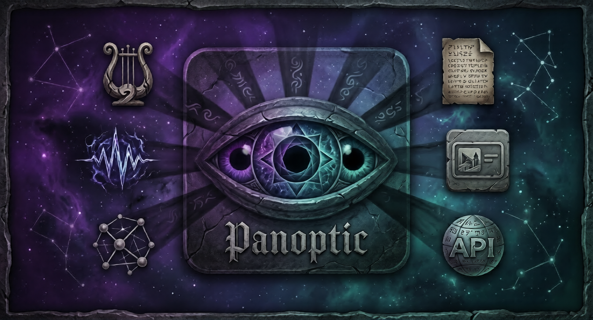

<p align="center">
  
</p>

<p align="center">
  <strong>A modular, cross-platform streaming toolkit for overlays, data bridges, and live integrations.</strong>
</p>

<p align="center">
  <a href="https://github.com/JaINTP/Panoptic/releases"></a>
  <a href="https://github.com/JaINTP/Panoptic/actions"></a>
  <a href="LICENSE"></a>
  <a href="https://discord.gg/psBjVfq663"></a>
  
</p>

---

Panoptic is a lightweight, always-on desktop toolkit that provides modular streaming utilities. Designed for high performance and deep customisability, Panoptic captures real-time data from media players and streaming platforms, piping it to styled OBS overlays, status bars, and custom integrations.

## Features

### 🔌 Modular Plugin Architecture
Panoptic is built on a compile-time plugin system. Every major feature (Spotify, Native Media, Twitch Alerts) is a self-contained module with its own:
- **Backend Logic:** Setup/Teardown hooks and background tasks.
- **HTTP Routing:** Custom Axum endpoints for OBS browser sources.
- **Dynamic UI:** Auto-generated configuration forms in the settings panel.

### 🎮 Advanced Twitch Integration
Full support for real-time Twitch events via EventSub WebSocket:
- **Twitch Hype Train:** Track progress levels, total contributions, and a dynamic top-contributor leaderboard.
- **Stream Alerts:** High-fidelity notifications for **Follows**, **Subscriptions**, **Gift Subs**, **Raids**, and **Cheers**.
- **Alert Stacking:** Multiple alerts can stack vertically. When an old alert expires, the remaining ones "drop" into place with a professional bouncing animation.
- **Lifecycle Management:** Customisable alert duration and a "Keep Last Alert" mode to ensure your stream always has a visual anchor.

### 🎨 High-Fidelity Theming
- **Live CSS Editor:** Side-by-side workspace with a real-time preview. Styles are injected instantly as you type.
- **Sticky Previews:** The preview container stays fixed at the top while you scroll through settings, ensuring you always see the visual impact of your changes.
- **Master Theme Library:** Ships with three complete aesthetic packs:
    - **Cyber-Neon:** High-contrast pink/cyan with scanlines and glitch effects.
    - **Eldritch Horror:** Dark void purples with organic "breathing" animations.
    - **1990s RPG:** Classic 16-bit console UI with pixel-perfect borders and "Royal Blue" skins.

### 🎵 Core Media Engine
- **Native Detection:** Reads from **MPRIS** (Linux) and **SMTC** (Windows) with zero browser extensions.
- **Spotify Fallback:** Automatic PKCE authentication and token refresh for Spotify Web API.
- **Output Templating:** Render track info to local text files for OBS Text Sources or any external dashboard.

---

## Architecture

Panoptic is a **Tauri 2** application (React + Vite frontend, Rust backend) using a modular crate layout:

```
Panoptic/
├── crates/
│   ├── panoptic-core/          # Core traits (PanopticPlugin, MediaProvider) & Shared Models
│   ├── panoptic-cache/         # Thread-safe asset & state cache
│   ├── audio/                  # Media providers (Linux, Windows, Spotify Web)
│   ├── services/
│   │   └── panoptic-server/    # Axum HTTP server for OBS Browser Sources
│   └── ui/
│       └── panoptic-gui/       # Main Tauri Application
```

### Plugin System

Every feature in Panoptic implements the `PanopticPlugin` trait. This trait allows plugins to hook into the application lifecycle and provide UI definitions.

```rust
pub trait PanopticPlugin: Send + Sync {
    fn id(&self) -> &'static str;
    fn name(&self) -> &'static str;

    // Logic setup (runs on app start)
    fn setup(&self, app: &tauri::AppHandle) -> Result<(), String>;

    // Define custom HTTP routes for overlays
    fn register_routes(&self, router: Router<AppState>) -> Router<AppState>;

    // Define UI fields (auto-generates the Settings UI)
    fn settings_definition(&self) -> Option<PluginSettingsDefinition>;

    // Handle button clicks from the UI
    fn handle_action(&self, action: &str, app: &tauri::AppHandle) -> Result<Value, String>;
}
```

### How to use Plugins
1. **Registration:** Plugins are registered in `crates/ui/panoptic-gui/src-tauri/src/lib.rs` inside the `PluginRegistry`.
2. **UI Generation:** If a plugin provides a `settings_definition`, Panoptic automatically renders a tab for it in the **Settings** window.
3. **Data Access:** React components can listen for Tauri events emitted by plugins (e.g., `twitch_hype_train`) to show live previews.

---

## Usage

### Live Overlay Customisation
1. Open **Settings** → **Display** tab.
2. Select an overlay (e.g., **Twitch Alerts**).
3. **Text Content:** Edit your messages using the **Variable Grid**. Click a variable like `{user}` to instantly insert it at your cursor.
4. **Custom CSS:** Use the right-hand editor to style your components. Use the **Simulate All Alerts** or **Test Hype Train** buttons to see animations in action.

### OBS Integration

**Browser Source:**
Add a new Browser source in OBS and point it to:
- **Now Playing:** `http://localhost:3000/overlay/now-playing`
- **Hype Train:** `http://localhost:3000/overlay/twitch/hype-train`
- **Alerts:** `http://localhost:3000/overlay/twitch/alerts`

The overlays pull their CSS directly from your Panoptic configuration.

### 📖 Theming Wiki
For detailed technical documentation on how to fully customize every aspect of your overlays, visit the **Theming Wiki**:
- [**Theming Overview**](docs/Theming-Overview.md) - How the CSS engine and side-by-side editor work.
- [**Now Playing CSS Guide**](docs/Now-Playing-CSS.md) - Variables for layout, typography, and progress.
- [**Hype Train CSS Guide**](docs/Hype-Train-CSS.md) - Variables for progress tiers and leaderboards.
- [**Twitch Alerts CSS Guide**](docs/Twitch-Alerts-CSS.md) - Variables for dynamic stacking and professional transitions.

---

## Installation & Building

Please see the [Architecture section](#architecture) for crate details. To build from source:

```bash
# Prerequisites: Rust (stable), Node.js (v22+), npm
cd crates/ui/panoptic-gui
npm install
npx tauri dev
```

Multi-platform builds are automated via [`build.py`](build.py).

---

## Configuration

Settings and Stylesheets are stored in:
- **Linux:** `~/.config/com.jaintp.panoptic/`
- **Windows:** `%APPDATA%\com.jaintp.panoptic\`

Stylesheets are physically stored as `{plugin_id}.css` in the `overlays/` subdirectory, allowing you to back them up or share them easily.

## License

MIT - See [LICENSE](LICENSE) for details.
